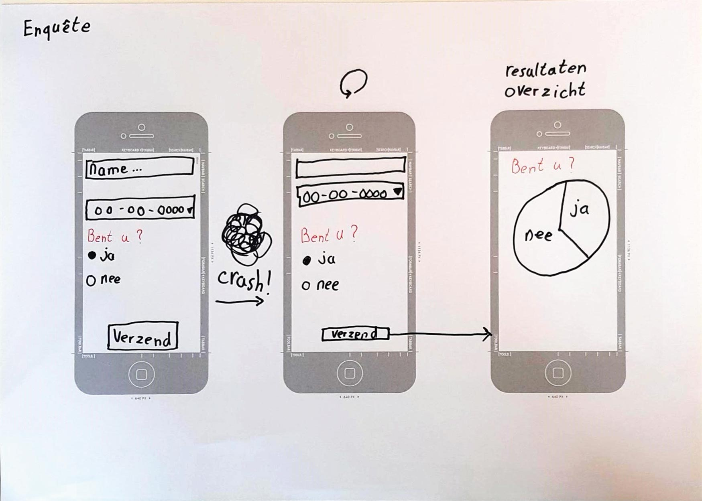

# Browser Technologies Opdracht 2
## Usecase
Ik wil een enquete kunnen invullen, met verschillende antwoord mogelijkheden, als ik de enquete niet afkrijg, wil ik later weer verder gaan met waar ik ben gebleven.

## Concept
__Webflow__

### Core functionaliteit
1. In de app kan de gebruiker een enquête invullen. Wanneer deze volledig is ingevuld en de gebruiker op <kbd>Verzend</kbd> heeft gedrukt wordt er een overzichts pagina getoond met de data van alle ingevulde enguêtes.
2. Wanneer de enquête voor de helft is ingevuld en de gebruiker de website verlaat en later terug komt zijn de eerder ingevulde antwoorden nog steeds ingevuld. 

#### Toepassen (code)
De tweede funcionaliteit is lastig als ik er van uitga dat de gebruiker de app opent in de Opera-mini browser en javascript is uitgeschakeld.  
__Ideeën:__ 
* Een server-side inlog-portaal maken. Zodat de app op basis van wie de gebruiker is de reeds ingevulde data kan ophalen en tonen.
* De enquête opdelen in meerdere pagina's. Wanneer de gebruiker naar de volgende vraag gaat worden de ingevulde velden in de URL opgeslagen. Wanneer de gebruiker opnieuw de (web)app opent hoeft alleen maar de URl worden ingevoert die de gebruiker had. 
Tuurlijk is dit niet veilig enzo. Maar wat betreft core func 

