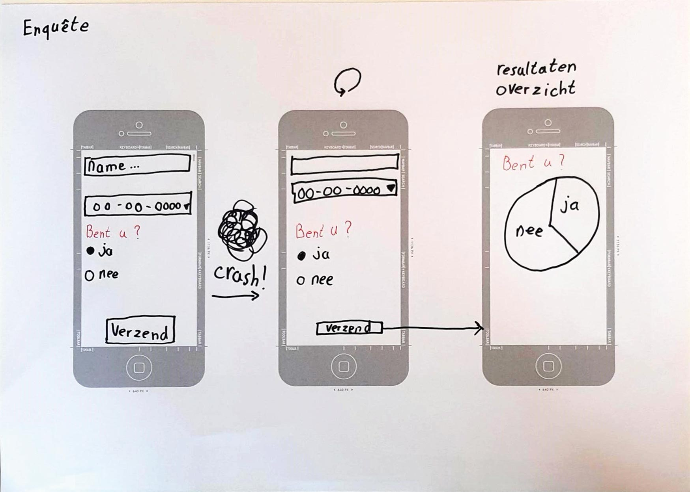
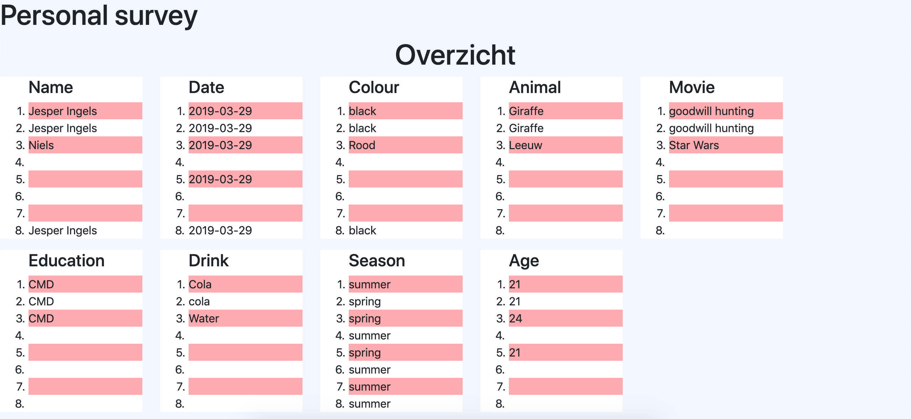
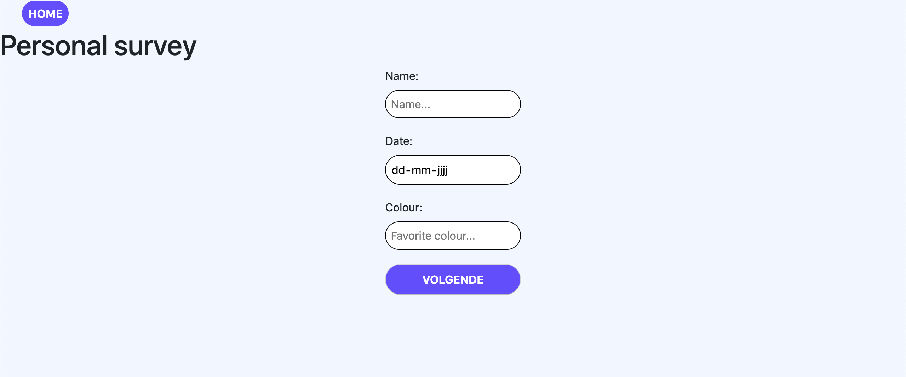
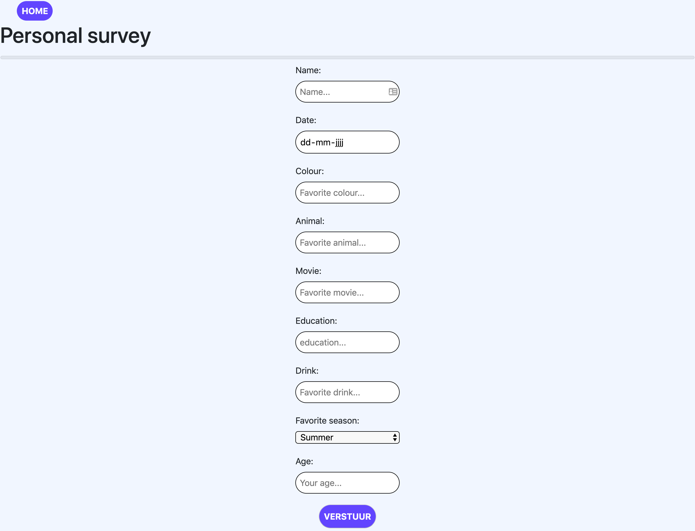
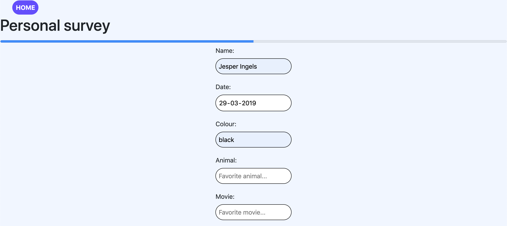
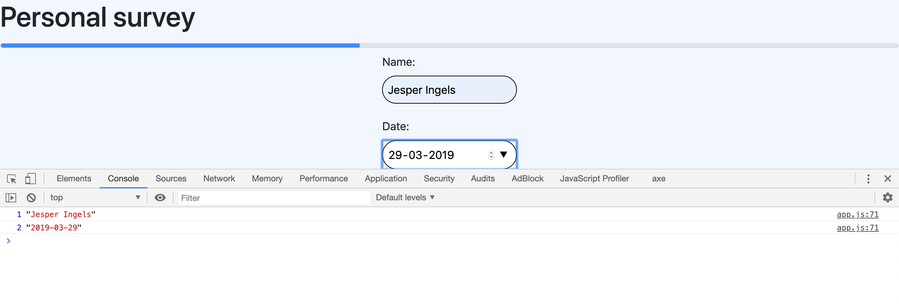

# Browser Technologies Opdracht 2

## Install
```
$ npm i
$ npm start
```

## Usecase
Ik wil een enquete kunnen invullen, met verschillende antwoord mogelijkheden, als ik de enquete niet afkrijg, wil ik later weer verder gaan met waar ik ben gebleven.

## Concept
__Webflow__


## App
### Server side rendering
De app wordt op de server gerenderd en naar de client geserveerd. Dit gebeurt m.b.v. een Express server.

### Data
De data die via het formulier naar de server wordt gestuurd wordt opgeslagen in een .text bestand. Wanneer de gebruiker 
de overzichts pagina opent wordt al deze data opgehaald en getoond. <br/>
__Overzichts pagina__



### Core functionaliteit
In de app kan de gebruiker een enquête invullen. Wanneer deze volledig is ingevuld en de gebruiker op <kbd>Verzend</kbd> heeft gedrukt wordt er een overzichts pagina getoond met de data van alle ingevulde enguêtes.
 

## Progressive Enhancement 
*Hoe heb ik Progressive Enhancement toegepast?* In het kort: Tijdens het bouwen van de app heb ik als 1e de core gemaakt.
Zodat de core functionaliteit ten alle tijden werkt. Pas als 2e stap wanneer er __wel javascript__ is wordt het huidige formulier
weggehaald en wordt het gehele formulier door javascript gerenderd. Ook wordt er een progress-bar toegevoegd en wordt de 
 waarde van de inputvelden opgeslagen in ``localStorage``. De waardes worden vanzelf terug ingevuld mocht de 
  gebruiker tussentijds de website verlaten. Als 3e en laastste stap is er een animatie toegevoegd 
iets toevoegd aan de gebruikers ervaring.
### Functional/reliable
__Javascript disabled__ <br/>
Alle input velden worden opgesplitst in 3 delen. Zodat de data tussentijds opgeslagen kan worden, mocht de gebruiker perongeluk de website sluiten. 


### Usable
__Javascript enabled__
De inputvelden worden allemaal op dezelfde pagina getoond.
Deze inputvelden worden via javascript met ``insertAdjecentHTML`` aan de html pagina toegevoegd


Ook wordt er een progress bar toegevoegd, deze wordt geupdate met Javascript.


Door gebruik te maken van localStorage worden de waardes van de inputvelden tijdelijk opgeslagen. Wanneer de gebruiker de website 
verlaat en later weer terugkeert zijn alle inputvelden nog met dezelfde waardes ingevuld.



### Pleasurable
__Er wordt van een erg moderne browser uitgegaan__
Wanneer de enquête wordt verstuurd is er een animatie waarbij de inputvelden inklappen.


## Feature detection
Voor het gebruik van de siteTimeout functie wordt er gecheckt of dit een bestaande functie is
```
if(typeof setTimeout == 'function')
```

Om de animation play state te veranderen wordt er gecheckt of het wel of niet defined is. 
```
if(userSelect.style.webkitAnimationPlayState !== undefined)
```

Als ``display: flex `` ondersteund wordt gebruik dan display flex om de content te positioneren.
```
@supports (display: flex)
```


